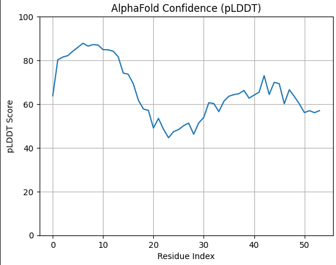

# AlphaFold2 – Insulin Structure Prediction

This repository documents my hands-on experience running DeepMind's AlphaFold2 on Google CLoud using Docker to predict the 3D structure of human insulin.

##  Objective
To predict the folded structure of human insulin from its amino acid FASTA sequence using the full database mode.

##  Stack
- AlphaFold2 (Docker)
- NVIDIA GPU (CUDA)
- HHblits, Jackhmmer, PDB70, UniRef90, MGnify, BFD
- Debian-based VM on cloud


## Insulin Output Files

This folder (`alphafold_insulin_output/insulin/`) contains:
- `unrelaxed_model_X_pred_0.pdb`: Raw structure predictions
- `unrelaxed_model_X_pred_0.cif`: Crystallographic Information Format for models
- `result_model_X_pred_0.pkl`: Python dictionary containing per-residue confidence scores, distograms, etc.
- `confidence_model_X_pred_0.json`: Confidence metrics
- `features.pkl`: Input features fed to the model

---

## Predicted Insulin Structure 

Below is the visualized result from the `unrelaxed_model_1_pred_0.pdb` output.


The structure was rendered using [Mol* Viewer](https://molstar.org/viewer/).


## Interpretation of Results

**Input Sequence Used:**
MALWMRLLPLLALLALWGPDPAAAFVNQHLCGSHLVEALYLVCGERGFFYTPKT

This represents the signal peptide and **B-chain** of human insulin. It **omits**:
- A-chain (required for insulin structure)
- C-peptide (in the proinsulin precursor)

As a result:
- The model lacks necessary domain interactions.
- Confidence and accuracy suffer.
- RMSD vs. native structure is poor.


##  MSA & Template Search Results

### UniRef90 MSA Hits
- Multiple insulin-like sequences aligned from human, mammals, reptiles, amphibians, and fish.
- Most matched only **partial regions** (primarily the B-chain).

### HHSearch Template Hits
Top template matches from the PDB:
| Rank | Template | Description | Score |
|------|----------|-------------|--------|
| 1    | 3WY7_B   | Human insulin | 92.7 |
| 2    | 6S0F_F   | Insulin receptor | 92.7 |
| 3    | 5URT_B   | Insulin Chain A | 91.5 |

Alignment range was partial: only residues **26–54** matched, which confirms only part of the insulin sequence was covered.


## Recommendation

To obtain meaningful structural predictions for insulin:

- Use the **full proinsulin sequence**, e.g. MALWMRLLPLLALLALWGPDPAAAFVNQHLCGSHLVEALYLVCGERGFFYTPKTRREAEDLQVGQVELGGGPGAGSLQPLALEGSLQKRGIVEQCCTSICSLYQLENYCN


## Model Confidence (pLDDT)

The confidence of each residue in the predicted structure is visualized below:



- Confidence is **high (~85–90)** at the N-terminal, but drops steadily.
- From residue 20 onward, many residues fall below **pLDDT 60**, indicating structural unreliability.
- This low confidence contributes to deviation from the experimentally known insulin structure.

---

## RMSD Comparison to Native Insulin (`2HIU`)

The AlphaFold model was structurally aligned to the native human insulin structure from the PDB (`2HIU.pdb`) using backbone Cα atoms.

- **RMSD**: `13.542 Å`
- A value this high reflects **major structural misalignment**.

**Cause:** Only the B-chain of insulin was used for prediction, while native insulin's correct folding requires both A- and B-chains.

---


# Troubleshooting AlphaFold

## Storage & Resource Issues
- Hit 100% disk capacity while extracting the 1.4TB BFD database.
- Resolved by requesting additional storage and monitoring space using `df -h`.
- Disk expansion didn’t reflect immediately; required a full VM reboot to remount and recognize added storage.

## Database & Extraction Issues
- Encountered error: `ValueError: Could not find HHBlits database`.
- Root cause: `bfd_metaclust_clu_complete_id30_c90_final_seq.sorted_opt.tar.gz` was partially extracted due to low disk space.
- Resolution:
  - Re-extracted the tarball using `tar -xvzf` after freeing up space.
  - Confirmed presence of all `.ffdata` and `.ffindex` files using `ls -lh`.

## NVIDIA Driver & CUDA Issues
- Running `nvidia-smi` initially failed due to broken NVIDIA driver (`nvidia-dkms` couldn't be configured).
- `amber_minimize.py` failed repeatedly with: No compatible CUDA device is available Minimization failed after 100 attempts.

- Solution: Skipped relaxation step by using the flag `--use_gpu_relax=False`.

## Docker Container & Mounting Issues
- AlphaFold couldn't detect databases due to incorrect volume mounts.
- Fixed by ensuring all paths were consistently mounted as: -v /mnt/alphafold-data:/mnt/alphafold-data -v /mnt/alphafold-data/alphafold:/app/alphafold
- Verified database paths inside the container using `ls` to ensure visibility.

## Connectivity & Lifecycle Interruptions
- The VM shut down mid-download due to bandwidth or inactivity limits.
- Large dataset downloads (like BFD, PDB, UniRef) were interrupted frequently.
- Solutions:
- Used `aria2c` and `rsync` to resume downloads reliably.
- Avoided `wget` on Kaggle by pre-cloning necessary files into mounted paths.


##  Citation


```bibtex
@article{jumper2021highly,
  title={Highly accurate protein structure prediction with AlphaFold},
  author={Jumper, John and Evans, Richard and Pritzel, Alexander and Green, Tim and Figurnov, Michael and Ronneberger, Olaf and Tunyasuvunakool, Kathryn and Bates, Russ and {\v{Z}}{\'\i}dek, Augustin and Potapenko, Anna and others},
  journal={Nature},
  volume={596},
  number={7873},
  pages={583--589},
  year={2021},
  publisher={Nature Publishing Group}
}


## Reproducibility & Debugging

Detailed execution logs and system-level debugging notes are documented separately:

- [COMMANDS.md](COMMANDS.md) — full AlphaFold run commands
- [TROUBLESHOOTING.md](TROUBLESHOOTING.md) — storage, database, GPU, and Docker issues

